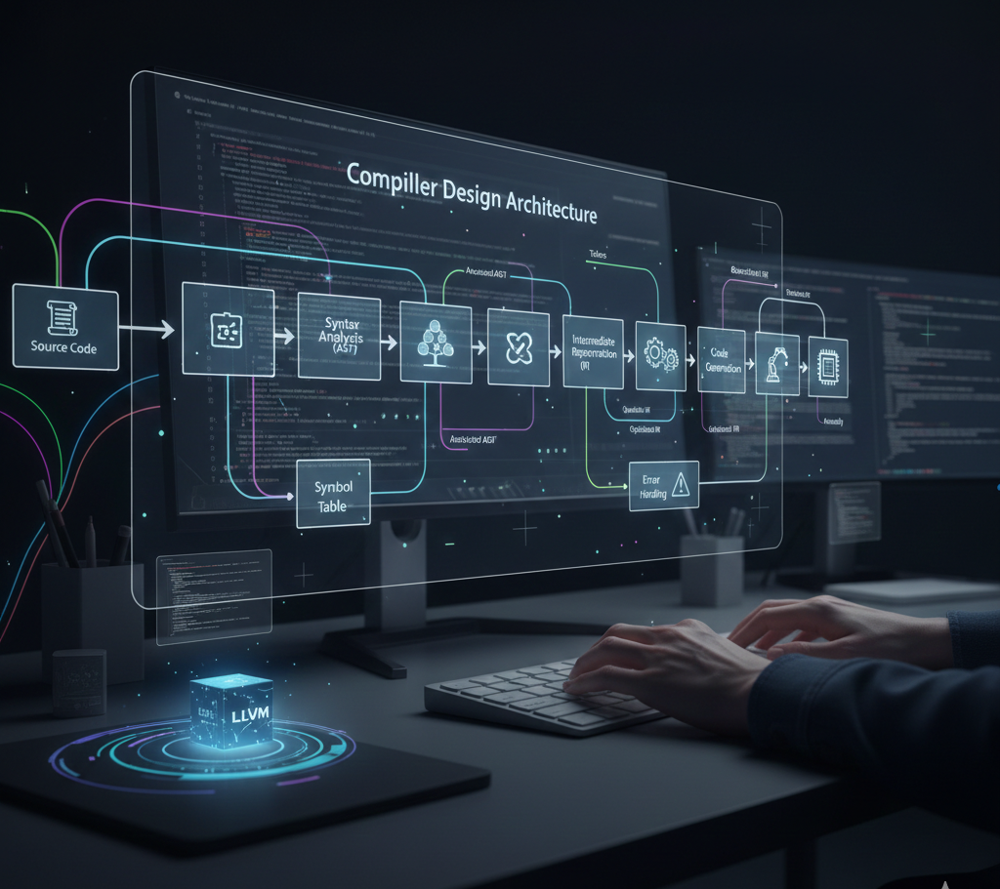

<div align="center">



<h1>🔧 Compiler Construction — Lexical Analysis & Parsing Fundamentals</h1>

<p style="color: #2563eb; margin: 15px 0; font-size: 1.1em;">🚀 A comprehensive compiler construction project featuring practical implementations of lexical analyzers using Lex/Flex. This repository demonstrates core compiler design concepts including tokenization, pattern matching, and lexical analysis with real-world examples and hands-on practice programs.</p>

<p style="font-size: 1.2em; color: #1e40af; background: linear-gradient(135deg, #dbeafe 0%, #bfdbfe 100%); padding: 20px; border-radius: 12px; max-width: 800px; margin: 20px auto; line-height: 1.6; border-left: 4px solid #2563eb;">
🎯 <b>9 Lex Programs</b> with examples | ⚡ <b>Lexical Analysis</b> | 🔍 <b>Pattern Matching</b> | 📊 <b>Token Recognition</b>
</p>

<p align="center">
  
  
  
  
  
</p>

</div>

---

## 📁 Project Structure

```
Compiler-Construction/
├── 📂 PCS-601/                     # Lab practice programs
│   ├── 📄 P1.l                     # Lex program 1
│   ├── 📄 P2.l                     # Lex program 2
│   ├── 📄 P3.l                     # Lex program 3
│   ├── 📄 P4.l                     # Lex program 4
│   ├── 📄 P5.l                     # Lex program 5
│   ├── 📄 P6.l                     # Lex program 6
│   ├── 📄 P7.l                     # Lex program 7
│   ├── 📄 P8.l                     # Lex program 8
│   ├── 📄 P9.l                     # Lex program 9
│   ├── 📄 input.c                  # Sample C input file
│   ├── 📄 input.html               # Sample HTML input file
│   └── 📄 Input.txt                # Sample text input file
├── 📂 assets/                      # Project assets
│   └── 🖼️ CompilerDesign.png       # Project banner image
├── 📄 README.md                    # Project documentation
├── 📄 LICENSE                      # MIT License
└── 📄 .gitignore                   # Git ignore patterns (.DS_Store, compiled files, etc.)
```

---

## 🎯 Learning Objectives

<div align="center">

| 📚 Topic | 📄 Program | 🎯 Learning Goal |
|----------|------------|------------------|
| **Lexical Analysis** | P1.l - P9.l | Token recognition, pattern matching |
| **Regular Expressions** | All Programs | Pattern definition and matching |
| **Token Generation** | All Programs | Identifying lexemes and tokens |
| **Symbol Tables** | Advanced Programs | Managing identifiers and symbols |
| **Error Handling** | All Programs | Detecting lexical errors |
| **Compiler Phases** | Complete Project | Understanding compilation process |

</div>

---

## 🚀 Getting Started

### 📋 Prerequisites

- 🔧 **Flex/Lex** - Lexical analyzer generator
- 💻 **GCC** - GNU Compiler Collection
- 🖥️ **Unix/Linux/macOS** - Terminal environment
- 📝 **Text Editor** - VS Code, Vim, or any IDE

### 🔧 Installation

#### macOS
```bash
# Install Flex using Homebrew
brew install flex

# Verify installation
flex --version
```

#### Linux (Ubuntu/Debian)
```bash
# Install Flex
sudo apt-get update
sudo apt-get install flex

# Verify installation
flex --version
```

### 🏃 Running the Programs

```bash
# Navigate to the project directory
cd PCS-601

# Compile a Lex program (example: P1.l)
flex P1.l
gcc lex.yy.c -o P1 -ll

# Run the compiled program
./P1 < Input.txt

# Or provide input interactively
./P1
```

### 📝 Quick Start Example

```bash
# Clone the repository
git clone https://github.com/AbhishekGiri04/compiler-construction.git

# Navigate to the project
cd Compiler-Construction/PCS-601

# Compile and run a program
flex P1.l && gcc lex.yy.c -o P1 -ll && ./P1 < Input.txt
```

---

## 📖 Program Descriptions

### 🔍 Lexical Analysis Programs

Each Lex program (P1.l through P9.l) demonstrates different aspects of lexical analysis:

- **Pattern Recognition** - Identifying tokens using regular expressions
- **Token Classification** - Categorizing lexemes into token types
- **Lexeme Extraction** - Capturing matched patterns
- **Action Execution** - Performing operations on recognized tokens
- **Error Detection** - Handling invalid input patterns

---

## 🛠️ Technologies Used

<div align="center">

<table>
<thead>
<tr>
<th>🖥️ Technology</th>
<th>⚙️ Purpose</th>
<th>📊 Usage</th>
</tr>
</thead>
<tbody>
<tr>
<td></td>
<td>Lexical analyzer generator</td>
<td>Pattern matching, token generation</td>
</tr>
<tr>
<td></td>
<td>Programming language</td>
<td>Implementation and compilation</td>
</tr>
<tr>
<td></td>
<td>C compiler</td>
<td>Compiling generated C code</td>
</tr>
</tbody>
</table>

</div>

---

## 🎓 Learning Outcomes

After exploring this project, you will understand:

✅ **Lexical Analysis** - First phase of compilation process  
✅ **Regular Expressions** - Pattern matching and recognition  
✅ **Token Generation** - Converting source code to tokens  
✅ **Lex/Flex Tool** - Using lexical analyzer generators  
✅ **Compiler Design** - Fundamental compiler construction concepts  
✅ **Pattern Matching** - Efficient string processing techniques  
✅ **Finite Automata** - DFA and NFA concepts in practice  
✅ **Error Handling** - Detecting and reporting lexical errors

---

## 🌟 Key Features

- **🔍 Comprehensive Examples** - 9 different Lex programs
- **📚 Educational** - Clear, well-commented code
- **🚀 Practical** - Real-world compiler concepts
- **🔧 Modular** - Separate programs for different concepts
- **📊 Test Cases** - Sample input files included
- **💡 Learning-Focused** - Step-by-step progression

---

## 📚 Compiler Construction Concepts

### Lexical Analysis Phase

The lexical analyzer (scanner) performs:

1. **Reading Input** - Character stream from source code
2. **Pattern Matching** - Using regular expressions
3. **Token Generation** - Creating token-lexeme pairs
4. **Symbol Table** - Managing identifiers
5. **Error Detection** - Reporting lexical errors

### Token Types

Common token categories:
- Keywords (if, while, for, etc.)
- Identifiers (variable names)
- Operators (+, -, *, /, etc.)
- Literals (numbers, strings)
- Delimiters (;, {, }, etc.)

---

## 🤝 Contributing

Contributions are welcome! Feel free to:

- 🐛 Report bugs or issues
- 💡 Suggest new Lex programs
- 📝 Add more examples
- 🎨 Improve documentation
- 🔧 Enhance existing programs

---

## 📞 Contact & Support

<div align="center">

> 💬 *Questions about this Compiler Construction project?*  
> Feel free to reach out for help or collaboration!

<br/>

**👤 Abhishek Giri** - Project Creator

<a href="https://linkedin.com/in/abhishek-giri04">
  
</a>  
<a href="https://github.com/abhishekgiri04">
  
</a>  
<a href="mailto:abhishekgiri.dev@gmail.com">
  
</a>

</div>

---

<div align="center">

## 📄 License

This project is open source and available under the **MIT License** - see the [LICENSE](LICENSE) file for details.

---

**🚀 Built with ❤️ for Learning Compiler Design**  
*Mastering Lexical Analysis & Compiler Construction*

<p style="font-size: 1.1em; color: #1e40af; margin: 20px 0;">
<b>Compiler Construction Project</b> — Lexical Analysis Fundamentals<br/>
<em>Building strong foundations in compiler design and implementation</em>
</p>

---

**© 2025 Abhishek Giri | Compiler Construction Project**

*Empowering developers with practical compiler design skills*


</div>
