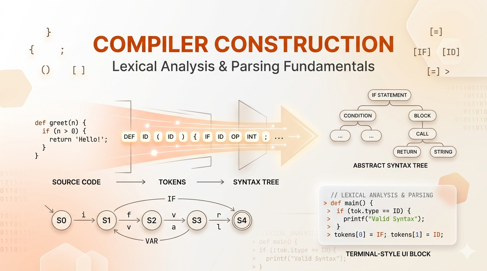

<div align="center">



<h1>🔧 Compiler Construction — Lexical Analysis & Parsing Fundamentals</h1>

<p style="color: #e65100; margin: 15px 0; font-size: 1.1em;">🚀 A hands-on compiler construction lab repository featuring <b>15 Lex/Flex programs</b> covering tokenization, pattern matching, DFA simulation, and real-world lexical analysis — built as part of the <b>PCS-601 Compiler Design</b> curriculum.</p>

<p style="font-size: 1.2em; color: #bf360c; background: linear-gradient(135deg, #fff3e0 0%, #ffe0b2 100%); padding: 20px; border-radius: 12px; max-width: 800px; margin: 20px auto; line-height: 1.6; border-left: 4px solid #e65100;">
📚 <b>15 Lex Programs</b> with examples | ⚙️ <b>DFA Simulation</b> | 🔍 <b>Lexical Analysis</b> | 📄 <b>C Implementation</b>
</p>

<p align="center">
  
  
  
  
  
  
</p>

</div>

---

## 📁 Project Structure

```
Compiler-Construction/
│
├── 📂 PCS-601/                          # Lab practice programs
│   │
│   ├── ── Theory ──
│   ├── 📄 P1.txt                        # Study of Lex & Yacc tools (theory notes)
│   │
│   ├── ── Lex Programs ──
│   ├── 📄 P2.l                          # Count lines, spaces, tabs & characters
│   ├── 📄 P3.l                          # Valid C identifier checker
│   ├── 📄 P4.l                          # Integer & floating point number classifier
│   ├── 📄 P5.l                          # C program tokenizer (keywords, operators, etc.)
│   ├── 📄 P6.l                          # Word, character & whitespace counter from file
│   ├── 📄 P7.l                          # Replace multiple whitespaces with single space
│   ├── 📄 P8.l                          # Remove single & multi-line C comments
│   ├── 📄 P9.l                          # Extract HTML tags from HTML file
│   ├── 📄 P10.l                         # Advanced C tokenizer (strings, char literals, etc.)
│   ├── 📄 P11.l                         # Even / odd number checker
│   ├── 📄 P12.l                         # Vowel & consonant counter
│   ├── 📄 P13.l                         # Email address validator
│   ├── 📄 P14.l                         # DFA — accept strings with even a's and even b's
│   ├── 📄 P15.l                         # DFA-based integer, float & identifier classifier
│   │
│   ├── ── Input / Output Files ──
│   ├── 📄 Input.txt                     # Sample text input (used by P6, P7)
│   ├── 📄 input.c                       # Sample C file (used by P8)
│   ├── 📄 sample.html                   # Sample HTML file (used by P9)
│   ├── 📄 tags.txt                      # HTML tags output reference
│   ├── 📄 out.c                         # Output C file (generated by P8)
│   ├── 📄 lex.yy.c                      # Auto-generated Lex output (do not edit)
│   │
│   └── 📄 CompilerDesignLabManual.pdf   # Official lab manual
│
├── 📂 assets/
│   └── 🖼️ CompilerDesign.png            # Project banner image
│
├── 📄 .gitattributes                    # Git language detection config
├── 📄 .gitignore                        # Ignores .DS_Store, compiled binaries, etc.
├── 📄 LICENSE                           # MIT License
└── 📄 README.md                         # Project documentation
```

---

## 💻 PCS-601 — Lab Programs

### 📖 Theory

| # | 📄 File | 📚 Topic |
|---|---------|----------|
| 1 | [P1.txt](PCS-601/P1.txt) | Study of Lex & Yacc — tools, structure, workflow |

### ⚙️ Lex Programs

#### 🔤 Basics & Counting

| # | 📄 File | 📚 Concept |
|---|---------|------------|
| 2 | [P2.l](PCS-601/P2.l) | Counts lines (`\n`), spaces, tabs, and other characters from stdin |
| 3 | [P3.l](PCS-601/P3.l) | Validates whether input strings are valid C identifiers |
| 4 | [P4.l](PCS-601/P4.l) | Classifies input as integer, floating point, or invalid number |
| 11 | [P11.l](PCS-601/P11.l) | Reads a number — prints whether it is even or odd |
| 12 | [P12.l](PCS-601/P12.l) | Counts total vowels and consonants in the entered string |

#### 🔍 Tokenization & Validation

| # | 📄 File | 📚 Concept |
|---|---------|------------|
| 5 | [P5.l](PCS-601/P5.l) | Tokenizes C code into keywords, separators, operators, constants, identifiers |
| 10 | [P10.l](PCS-601/P10.l) | Advanced tokenizer — classifies KEYWORD, STRING, LITERAL, CONSTANT, IDENTIFIER |
| 13 | [P13.l](PCS-601/P13.l) | Validates email addresses using regex pattern matching |

#### 📂 File I/O & Processing

| # | 📄 File | 📚 Concept |
|---|---------|------------|
| 6 | [P6.l](PCS-601/P6.l) | Reads `Input.txt` — counts total characters, words, and whitespaces |
| 7 | [P7.l](PCS-601/P7.l) | Reads `Input.txt` — compresses multiple spaces into one, writes to `Output.txt` |
| 8 | [P8.l](PCS-601/P8.l) | Reads a `.c` file — strips `//` and `/* */` comments, writes to `out.c` |
| 9 | [P9.l](PCS-601/P9.l) | Reads an HTML file — extracts all `<tags>` into an output file |

#### 🧠 DFA Simulation

| # | 📄 File | 📚 Concept |
|---|---------|------------|
| 14 | [P14.l](PCS-601/P14.l) | DFA simulation — accepts strings with even number of `a`'s and `b`'s |
| 15 | [P15.l](PCS-601/P15.l) | DFA-based classifier — identifies integers, floats, and identifiers using states |

---

## 🚀 Getting Started

### Prerequisites

- **Flex** — Lexical analyzer generator
- **GCC** — GNU C Compiler
- **Unix / Linux / macOS** terminal

### Install Flex

```bash
# macOS
brew install flex

# Ubuntu / Debian
sudo apt-get install flex

# Verify
flex --version
```

### Run Any Program

```bash
cd PCS-601

# Step 1 — Generate C code from Lex file
flex P2.l

# Step 2 — Compile
gcc lex.yy.c -o P2 -ll

# Step 3 — Run
./P2
```

### Program-Specific Commands

```bash
# P6, P7 — reads from Input.txt
flex P6.l && gcc lex.yy.c -o P6 -ll && ./P6

# P7 — writes compressed output to Output.txt
flex P7.l && gcc lex.yy.c -o P7 -ll && ./P7

# P8 — removes comments from a C file
flex P8.l && gcc lex.yy.c -o P8 -ll && ./P8 input.c

# P9 — extracts HTML tags (prompts for filenames)
flex P9.l && gcc lex.yy.c -o P9 -ll && ./P9
# Enter: sample.html → then output filename
```

> No external dependencies — just Flex, GCC, and a terminal.

---

## 🎓 Learning Outcomes

After exploring this project, you will understand:

✅ **Lex File Structure** — Definitions, rules, and user code sections  
✅ **Regex Patterns** — Writing patterns for token recognition  
✅ **Lexical Analysis** — Tokenizing C source code end-to-end  
✅ **DFA Simulation** — Implementing states with `%s` and `BEGIN`  
✅ **Comment Stripping** — Removing `//` and `/* */` from C programs  
✅ **File I/O in Lex** — Using `yyin`, `yyout`, `fopen`, `fprintf`  
✅ **Regex Validation** — Email addresses, identifiers, numbers  
✅ **HTML Processing** — Extracting tags from real HTML files  

---

## 🛠️ Tech Stack

<div align="center">

<table>
<thead>
<tr>
<th>🖥️ Technology</th>
<th>⚙️ Purpose</th>
<th>📊 What's Covered</th>
</tr>
</thead>
<tbody>
<tr>
<td></td>
<td>Lexical Analyzer Generator</td>
<td>Pattern matching, token generation, DFA states, start conditions</td>
</tr>
<tr>
<td></td>
<td>Implementation Language</td>
<td>All programs, file I/O, user code sections, yywrap()</td>
</tr>
<tr>
<td></td>
<td>Compilation</td>
<td>Compiles Lex-generated C code into runnable executables</td>
</tr>
</tbody>
</table>

</div>

---

## 🌟 Key Features

- **📄 15 Lex Programs** — Covering a wide range of compiler design concepts
- **📚 Educational** — Clear, well-structured code with progressive difficulty
- **🧠 DFA Simulation** — Real finite automata implemented using Lex states
- **🔧 Modular** — Separate `.l` file for each concept, easy to explore
- **⚙️ Zero Setup** — Just Flex + GCC, no extra dependencies
- **💡 Learning-Focused** — Step-by-step progression from basics to DFA simulation

---

## 📞 Contact & Support

<div align="center">

> 💬 *Questions about this project?*  
> Feel free to reach out for help or collaboration!

<br/>

**👤 Abhishek Giri** — Creator & Maintainer

<a href="https://linkedin.com/in/abhishek-giri04">
  
</a>  
<a href="https://github.com/abhishekgiri04">
  
</a>  
<a href="mailto:abhishekgiri.dev@gmail.com">
  
</a>

</div>

---

<div align="center">

## 📄 License

This project is open source and available under the **MIT License** — see the [LICENSE](LICENSE) file for details.

---

**🔧 Built with ❤️ for Learning Compiler Design**  
*Mastering Lex, Flex & C from the ground up*

<p style="font-size: 1.1em; color: #bf360c; margin: 20px 0;">
<b>Compiler Construction</b> — Lexical Analysis & Parsing Fundamentals<br/>
<em>Building strong foundations in compiler design</em>
</p>

---

**© 2026 Abhishek Giri | Compiler Construction**

*Empowering developers with practical compiler design skills*


</div>
